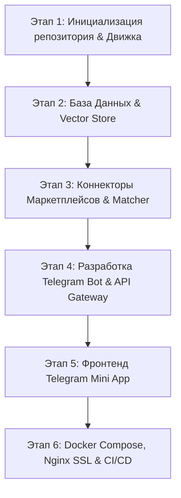

# План Развертывания Инфраструктуры и Этапов Разработки SmartSearch TMA

Документ содержит два основных раздела:
1. **Чек-лист для Пользователя:** Пошаговый список сервисов, серверов, ботов и API-ключей, которые необходимо зарегистрировать и подготовить.
2. **План Разработки (Движок & TMA):** Пошаговая реализация системы со стороны разработчика.

---

## Часть 1: Чек-лист Подготовки Инфраструктуры (Для Пользователя)

Для полноценного запуска и автоматического деплоя системы вам потребуется подготовить следующие компоненты:

### 1. Telegram Bot (через BotFather)
- [ ] Перейти в Telegram к [@BotFather](https://t.me/BotFather) и создать нового бота (`/newbot`).
- [ ] Сохранить полученный **`BOT_TOKEN`** (пример: `7123456789:AAH...`).
- [ ] Настроить бота в BotFather:
  - Отправить `/setdescription` и `/setabouttext`.
  - Включить inline mode: `/setinline` -> `Enabled`.
  - Установить Domain для WebApp: `/setdomain` (указать домен вашего TMA).

### 2. Серверные Мощности (VPS / VDS Сервер)
- [ ] Выбрать провайдера (Selectel, Hetzner, DigitalOcean, TimeWeb и т.д.).
- [ ] Заказать VPS с характеристиками:
  - **ОС:** Ubuntu 22.04 LTS или Ubuntu 24.04 LTS.
  - **CPU:** минимум 4 vCPU (рекомендуется 8 vCPU для работы Qdrant vector DB & CLIP AI).
  - **RAM:** минимум 8 GB (рекомендуется 16 GB).
  - **SSD/NVMe:** 80+ GB.
- [ ] Доменное имя (например, `smartsearch.app` или любой другой домен) с управлением DNS-записями (A-записи направлены на IP сервера):
  - `api.yourdomain.com` -> IP сервера (Бекенд REST API & Webhook бота).
  - `tma.yourdomain.com` -> IP сервера или Vercel/Netlify (Фронтенд Mini App).
- [ ] Предоставить доступ к серверу по SSH (IP-адрес + SSH-ключ или root-пароль).

### 3. API Ключи и Аккаунты Маркетплейсов
- [ ] **Ozon:** 
  - Аккаунт в Ozon Performance / Seller API или Admitad Affiliate.
  - Получить `Client-Id` и `Api-Key`.
- [ ] **Wildberries:**
  - Токен API WB Партнеры / Статистика.
  - Получить API токен в кабинете `supplies.wildberries.ru` или `affiliate.wildberries.ru`.
- [ ] **Яндекс.Маркет:**
  - Токен Партнерского API Яндекс Маркета (`OAuth Token` + `Campaign ID`).
- [ ] **AliExpress / CPA-Сеть (Admitad / VK Target):**
  - Ключи доступа к Admitad API для генерации реферальных диплинков с комиссией.

### 4. Прокси-серверы (Для защищенного скрапинга)
- [ ] Зарегистрировать аккаунт в прокси-сервисе (BrightData, Smartproxy или Webshare).
- [ ] Получить доступ к пулу HTTPS/SOCKS5 резидентских прокси с ротацией IP (`PROXY_HOST`, `PROXY_PORT`, `PROXY_USER`, `PROXY_PASS`).

---

## Часть 2: Пошаговый План Разработки (Движок, TMA & Бот)

После готовности инфраструктурного чек-листа разработчик выполняет следующие этапы:

### [Компонент 1] Структура Проекта и Инфраструктурная База
#### [NEW] [docker-compose.yml](file:///c:/Sher_AI_Studio/projects/PVZ/docker-compose.yml)
#### [NEW] [.env.example](file:///c:/Sher_AI_Studio/projects/PVZ/.env.example)
#### [NEW] [backend/app/main.py](file:///c:/Sher_AI_Studio/projects/PVZ/backend/app/main.py)
#### [NEW] [frontend/package.json](file:///c:/Sher_AI_Studio/projects/PVZ/frontend/package.json)

- Создание гибридной структуры репозитория: `backend/` (FastAPI + aiogram 3) и `frontend/` (React + Vite + Tailwind + `@telegram-apps/sdk`).
- Настройка конфигураций `.env` и Pydantic settings.

---

### [Компонент 2] База Данных и Векторный Поиск
#### [NEW] [backend/app/db/session.py](file:///c:/Sher_AI_Studio/projects/PVZ/backend/app/db/session.py)
#### [NEW] [backend/app/models/](file:///c:/Sher_AI_Studio/projects/PVZ/backend/app/models/)
#### [NEW] [backend/app/services/qdrant_service.py](file:///c:/Sher_AI_Studio/projects/PVZ/backend/app/services/qdrant_service.py)
#### [NEW] [backend/app/services/meili_service.py](file:///c:/Sher_AI_Studio/projects/PVZ/backend/app/services/meili_service.py)

- Инициализация моделей SQLAlchemy (PostgreSQL 16): `users`, `master_products`, `offers`, `price_history`, `price_alerts`.
- Настройка подключения к Qdrant (векторный поиск по фото CLIP) и Meilisearch (полнотекстовый поиск с исправление опечаток).

---

### [Компонент 3] Коннекторы Маркетплейсов и Поисковый Движок
#### [NEW] [backend/app/connectors/wb.py](file:///c:/Sher_AI_Studio/projects/PVZ/backend/app/connectors/wb.py)
#### [NEW] [backend/app/connectors/ozon.py](file:///c:/Sher_AI_Studio/projects/PVZ/backend/app/connectors/ozon.py)
#### [NEW] [backend/app/connectors/yandex.py](file:///c:/Sher_AI_Studio/projects/PVZ/backend/app/connectors/yandex.py)
#### [NEW] [backend/app/services/matcher.py](file:///c:/Sher_AI_Studio/projects/PVZ/backend/app/services/matcher.py)

- Параллельные асинхронные клиенты для сбора товаров с WB, Ozon и Я.Маркет.
- Алгоритм дубликации карточек (Matching Engine): точные SKU -> Levenshtein distance -> Cosine similarity в Qdrant.

---

### [Компонент 4] Телеграм Бот & REST API Backend
#### [NEW] [backend/app/bot/main.py](file:///c:/Sher_AI_Studio/projects/PVZ/backend/app/bot/main.py)
#### [NEW] [backend/app/api/v1/search.py](file:///c:/Sher_AI_Studio/projects/PVZ/backend/app/api/v1/search.py)
#### [NEW] [backend/app/api/v1/alerts.py](file:///c:/Sher_AI_Studio/projects/PVZ/backend/app/api/v1/alerts.py)

- Реализация хэндлеров бота на `aiogram 3.x`: `/start`, обработка фото и ссылок.
- Реализация REST API на `FastAPI`: проверка `Telegram.WebApp.initData`, поиск `/search`, получение истории цен и алертов.

---

### [Компонент 5] Интерфейс Telegram Mini App (TMA)
#### [NEW] [frontend/src/App.tsx](file:///c:/Sher_AI_Studio/projects/PVZ/frontend/src/App.tsx)
#### [NEW] [frontend/src/components/HomeScreen.tsx](file:///c:/Sher_AI_Studio/projects/PVZ/frontend/src/components/HomeScreen.tsx)
#### [NEW] [frontend/src/components/ProductCard.tsx](file:///c:/Sher_AI_Studio/projects/PVZ/frontend/src/components/ProductCard.tsx)
#### [NEW] [frontend/src/components/PriceChart.tsx](file:///c:/Sher_AI_Studio/projects/PVZ/frontend/src/components/PriceChart.tsx)

- Создание UI в концепции Telegram Native Look & Feel.
- График истории цен (Recharts), выбор платформ, слайдер скидок дня, Haptic Feedback при кликах.

---

### [Компонент 6] Деплой, Nginx и CI/CD
#### [NEW] [nginx/nginx.conf](file:///c:/Sher_AI_Studio/projects/PVZ/nginx/nginx.conf)
#### [NEW] [.github/workflows/deploy.yml](file:///c:/Sher_AI_Studio/projects/PVZ/.github/workflows/deploy.yml)

- Конфигурация Nginx с поддержкой SSL (Certbot Let's Encrypt), HTTP/2 и Rate-Limiting.
- Автоматический деплой на VPS через GitHub Actions по push в main.

---

## План Верификации и Тестирования

### Автоматизированные Тесты
1. **Юнит-тесты валидации Telegram initData:** Проверка HMAC-SHA256 подписи.
2. **Тесты алгоритма Matching Engine:** Проверка корректности слияния одинаковых карточек с разным написанием.
3. **Тесты API эндпоинтов:** `pytest-asyncio` для проверки `/api/v1/search`, `/api/v1/alerts`.

### Ручная Верификация
1. **Тестирование в Telegram:**
   - Открытие бота в мобильном и десктопном клиентах Telegram.
   - Проверка нажатия кнопки меню `🚀 Открыть SmartSearch`.
   - Загрузка фото товара в чат и получение ответа с инлайн-кнопками.
2. **Проверка работы алертов:**
   - Симуляция падения цены в БД и получение push-уведомления в Telegram чате от бота.
